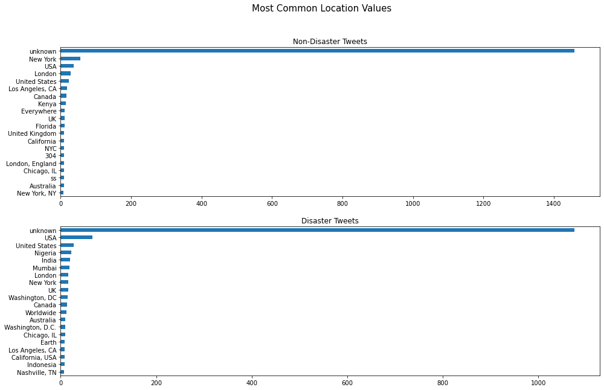
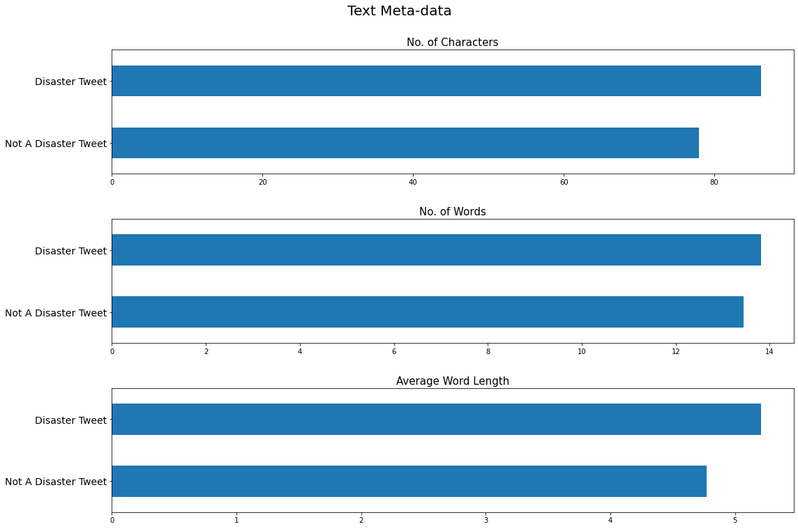

#### Jimmy Radford - November 2021

# Natural Language Processing with Disaster Tweets

## Overview

A short personal project on building a machine learning model to predict whether a tweet refers to a real-life disaster or not.

The data was obtained from a [Kaggle competition dataset](https://www.kaggle.com/c/nlp-getting-started/overview).

There were 7613 tweets in the dataset with five different columns: a unique identifier for the tweet, a pre-created keyword summarising the tweet's content, the location the tweet was sent from, the tweet itself and a column containing binary values for whether the tweet referred to a disaster or not.

## Data Cleaning

There were 87 null values in the keyword column and 3638 in the location column. All of these were filled with the string 'unknown'.

The keyword column contained words summarising the content of the tweet such as 'collision', 'fatality' and 'volcano'. Where the keywords were similar, they were grouped in to one (e.g. 'bombed' and 'bombing' were replaced with 'bomb'). This reduced the overall number of keywords from 187 to 149.

The location column was very messy. Some values contained the country, some contained the state, some contained both and some neither! Even though it was probably a less effective method for extracting detail, I took the slightly lazy option of count-vectorising the column in to unigrams at the pre-processing stage rather than cleaning it to create neat and tidy categorical values.

## Feature Engineering

Meta-data were created for the following attributes:

  - Number of:
    - URLs
    - emojis
    - mentions
    - hashtags
    - characters
    - words
  - Average word length

The tweets were treated in the following ways:

  - Punctuation and digits removed
  - Contractions expanded
  - All letters converted to lower-case
  - Stop-words removed
  - All tweets tokenised and and lemmatised
  sdcsdcsd
