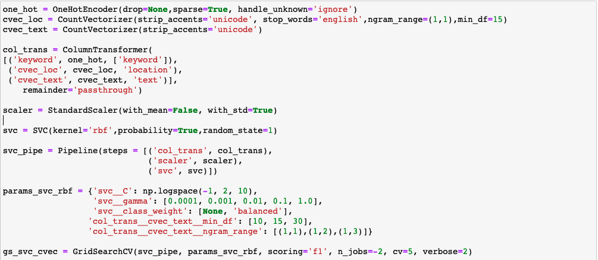
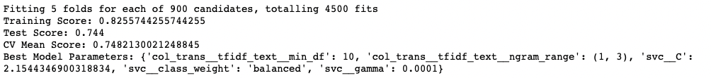
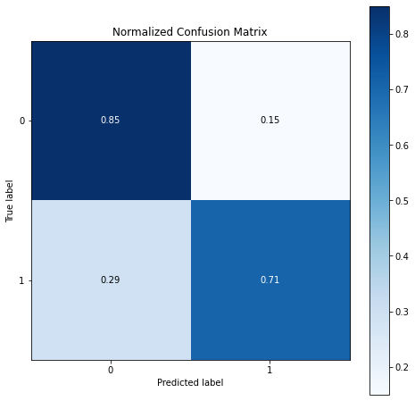
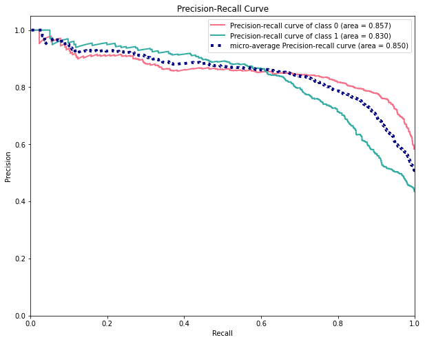
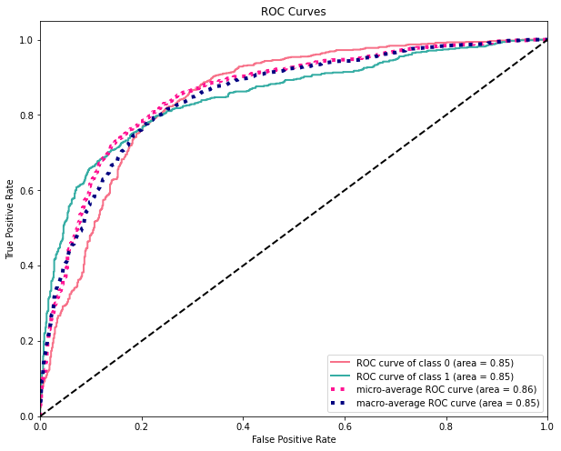

#### Jimmy Radford - November 2021

# Natural Language Processing with Disaster Tweets

## Overview

A short personal project on building a machine learning model to predict whether a tweet refers to a real-life disaster or not.

The data was obtained from a [Kaggle competition dataset](https://www.kaggle.com/c/nlp-getting-started/overview).

There were 7613 tweets in the dataset with five different columns: a unique identifier for the tweet, a pre-created keyword summarising the tweet's content, the location the tweet was sent from, the tweet itself and a column containing binary values for whether the tweet referred to a disaster or not.

## Data Cleaning

There were 87 null values in the keyword column and 3638 in the location column. All of these were filled with the string 'unknown'.

The keyword column contained words summarising the content of the tweet such as 'collision', 'fatality' and 'volcano'. Where the keywords were similar, they were grouped in to one (e.g. 'bombed' and 'bombing' were replaced with 'bomb'). This reduced the overall number of keywords from 187 to 149.

The location column was very messy. Some values contained the country, some contained the state, some contained both and some neither! Even though it was probably a less effective method for extracting detail, I took the slightly lazy option of count-vectorising the column in to unigrams at the pre-processing stage rather than cleaning it to create neat and tidy categorical values.

## Feature Engineering

Meta-data were created for the following attributes:

  - Number of:
    - URLs
    - emojis
    - mentions
    - hashtags
    - characters
    - words
  - Average word length

The tweets were treated in the following ways:

  - Punctuation and digits removed
  - Contractions expanded
  - All letters converted to lower-case
  - Stop-words removed
  - All tweets tokenised and and lemmatised

## Pre-Processing

The data set was split in to an 80:20 train and test set before being put through the following pre-processing steps:

  - Keyword: one-hot encoded
  - Location: count-vectorized unigrams
  - Text: a grid search was performed over the Tf-idfVectorizer parameters to find the optimal settings, with an ngram_range of (1,3) and min_df value of 10 performing best
  - All columns were standardised

## Modelling

A variety of models were fitted on the dataset, with support vector classifier receiving the highest F1 score for the target variable. The image below details all of the pre-processing steps and the range of parameters searched over by the grid search.

Here are the scores achieved by the model along with the optimal parameters:

## Visual Analysis of Predictions

## Conclusion

The model performed relatively well at predicting whether tweets referred to a disaster. The highest cross-validated mean F1 score of 0.748 was achieved by support vector classifier which was a nice improvement on the 0.710 score from a vanilla logistic regression model.

A low recall score of 0.71 for disaster tweets showed that a large portion of the disaster tweets were being incorrectly labelled. Having said this though, the precision values for both classes were both high, at between 0.78 - 0.80.

The decreasing gradient of the ROC curve for disaster tweets (class 1) shows that as the probability threshold reaches the mid-point, it quickly starts to mis-label disaster tweets.
